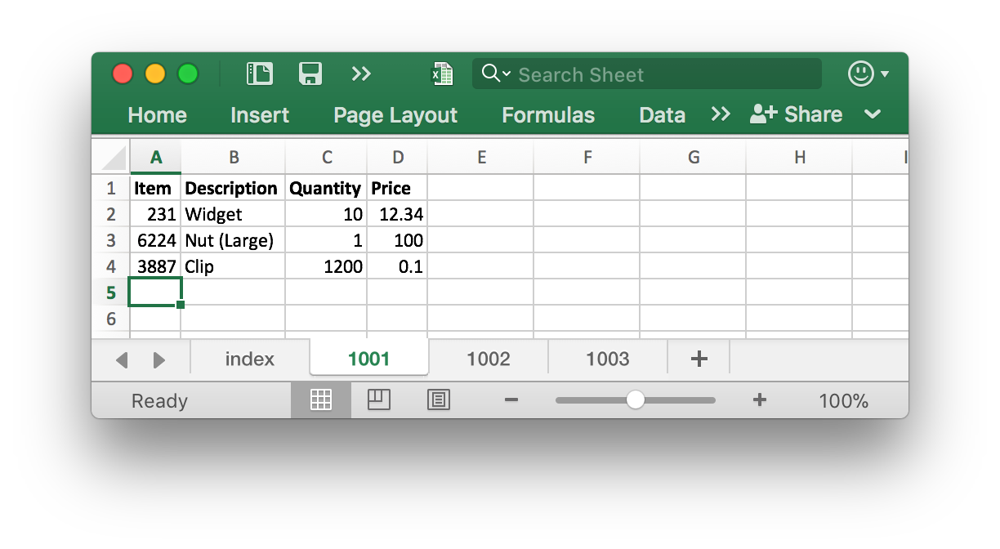
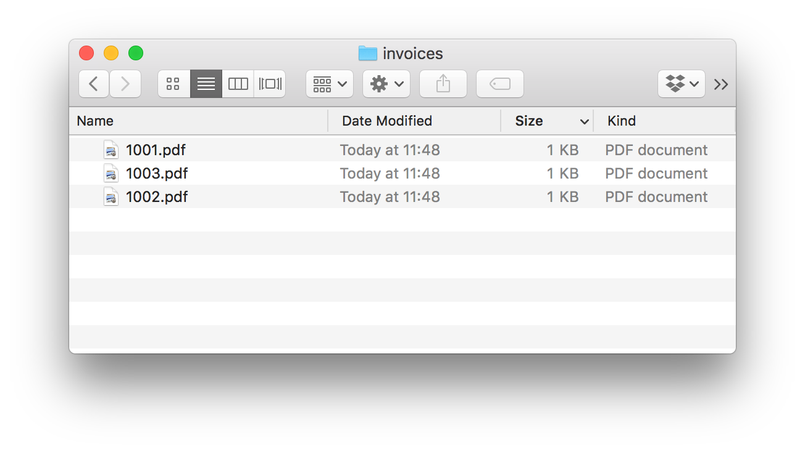

# Kamura: Groovy builders and readers for day-to-day data formats

John Hurst <john.b.hurst@gmail.com>
v0.0.1, 2016-06-04

Kamura is a project containing Groovy builders and readers for creating and processing
popular types of data that are common in day-to-day work.

* Groovy [builder DLSs](http://groovy-lang.org/dsls.html) construct objects using clean, readable code.
* Groovy reader modules provide convenient wrappers for reading objects, e.g. providing closure support.

"Kamura" is the Māori word for carpenter.

Kamura is organised into very small modules, so that you do not need to add dependencies for what you don't need.

* [kamura-groovy-gdata](kamura-groovy-gdata/README.md): Groovy reader for Google Sheets
* [kamura-groovy-hssf](kamura-groovy-hssf/README.md): Groovy builder/reader for Microsoft Office XLS workbooks
* [kamura-groovy-itext2](kamura-groovy-itext2/README.md): Groovy builder for PDF documents using iText2
* [kamura-groovy-itext5](kamura-groovy-itext5/README.md): Groovy builder for PDF documents using iText5
* [kamura-groovy-xssf](kamura-groovy-xssf/README.md): Groovy builder/reader for Microsoft Office XLSX (Office 2007) workbooks
* [kamura-groovy-zip4j](kamura-groovy-zip4j/README.md): Groovy builder/reader for ZIP streams using [Zip4j](http://www.lingala.net/zip4j/)
* [kamura-groovy-zip](kamura-groovy-zip/README.md): Groovy builder/reader for ZIP streams using JDK ZIP support

Each module provides enhanced functionality for building and reading common business formats supported by
an existing Java library.

So for example, kamura-groovy-itext2 wraps the [iText library](http://itextpdf.com) (version 2.x).
kamura-groovy-xssf wraps the [Apache POI library](https://poi.apache.org/).

There are a few other modules in the project too, providing tools and demonstration programs.

## Examples

Each subproject has simple examples of usage.

Here are some examples that combine features from different subprojects.

### XLSX to ZIP containing PDFs

In this example we read invoice data from an Excel file, and produce a ZIP file containing PDF invoices.

The Excel file has a header sheet giving the list of invoices. For each invoice there is an invoice number, date and customer name:

~[Excel index sheet](doc/images/invoices-xlsx-index.png)

For each invoice there is a detail sheet named for the invoice number, with the item ID, description, quantity and price:



Our sample program produces a ZIP file containing PDF invoices:



Each PDF is an invoice from the Excel data:


The full sample program is [Xlsx2PdfZip.groovy](doc/Xlsx2PdfZip.groovy).

Run the program on the provided sample file like this:

``` bash
groovy doc/Xlsx2PdfZip.groovy doc/invoices.xlsx
```

This sample imports three Kamura modules:

``` groovy
@Grab("nz.kamura:kamura-groovy-itext2:0.0.2")
@Grab("nz.kamura:kamura-groovy-xssf:0.0.2")
@Grab("nz.kamura:kamura-groovy-zip:0.0.2")
```

It reads the Excel file and processes the data in the index sheet using `WorkbookReader`:

``` groovy
new File(inputFileName).withInputStream { is ->
  Workbook workbook = new XSSFWorkbook(is)
  //...
  WorkbookReader.each(workbook.getSheet("index")) { String invoiceNumber, LocalDate invoiceDate, String customer ->
    println invoiceNumber
    Sheet sheet = workbook.getSheet(invoiceNumber)
    //...
    WorkbookReader.each(sheet) { int id, String description, int quantity, BigDecimal price ->
      //...
      totalAmount += quantity * price
    }
  }
}
```

It creates the ZIP file using `ZipBuilder`:

``` groovy
new File(outputFileName).withOutputStream { zos ->
  new ZipBuilder(zos).zip {
    // each invoice number ...
    entry("${invoiceNumber}.pdf") { os ->
      // write data for this invoice PDF to OutputStream 'os'
    }
  }
}
```

If creates the invoice PDFs using `IText2Builder`:

``` groovy
new IText2Builder(os).document {
  def header = { String text -> paragraph(string: text, font: HEADER_FONT, alignment: Element.ALIGN_RIGHT, spacingAfter: -4f)}
  def hcell = { String text -> cell(new Paragraph(text, TH_FONT), horizontalAlignment: Element.ALIGN_CENTER)}
  def lcell = { String text -> cell(new Paragraph(text, TD_FONT), horizontalAlignment: Element.ALIGN_LEFT)}
  def rcell = { String text -> cell(new Paragraph(text, TD_FONT), horizontalAlignment: Element.ALIGN_RIGHT)}

  header("Invoice Number: " + invoiceNumber)
  header("Invoice Date: " + invoiceDate.format(DateTimeFormatter.ofPattern("d MMM yyyy")))
  header(customer)
  header(" ")
  BigDecimal totalAmount = 0
  table([0.4f, 0.3f, 0.3f] as float[], widthPercentage: 100) {
    hcell("Description") ; hcell("Quantity") ; hcell("Price")
    WorkbookReader.each(sheet) { int id, String description, int quantity, BigDecimal price ->
      lcell(description) ; rcell(Q_FORMAT.format(quantity)) ; rcell(P_FORMAT.format(price))
      totalAmount += quantity * price
    }
  }
  header(" ")
  header("Total Amount Due: " + P_FORMAT.format(totalAmount))
}
```
